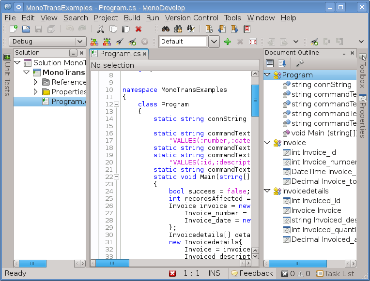
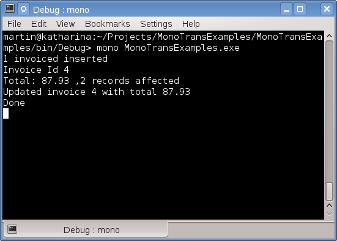

# Entendiendo Transacciones (Transactions) con ADO .NET y PostgreSQL

En .NET las transacciones son representadas por la clase Transaction que implementa la interfaz <a href="http://msdn.microsoft.com/en-us/library/system.data.idbtransaction.aspx">IDbTransaction</a> definida dentro del ensamblado System.Data
esta interfaz proporciona los métodos:  

<b>Commit:</b> Confirma la transacción y persiste los datos.

<b>Rollback:</b> Regresa los datos a un estado anterior a la transacción.
  
			
Esta interfaz se utiliza para crear clases Transaction asociadas con un proveedor especifico, así para SQL Server tenemos <i>SqlTransaction</i>, para Oracle <i>OracleTransaction</i> y para PostgreSQL <i>NpgsqlTransaction</i>.

La ventaja de crear transacciones en .NET y no en la bases de datos es proporcionar  a la aplicaciones la capacidad de las transacciones en caso de utilizar una base de datos que no proporcione o soporte esa característica.
 
Como ejemplo escribimos un programa en MonoDevelop que utiliza las tablas: <i>Invoices</i> e <i>InvoiceDetails</i> que se utilizaron en esta 
<a href="http://xomalli.blogspot.mx/2013/03/entendiendo-transacciones-con-postgresql.html">entrada</a>  este programa utiliza una transaction y 4 comandos SQL con los que guarda una factura (invoice) con dos detalles (invoice details), actualizando el total de la factura conforme a la cantidad de productos y su precio.

Este programa asocia una transacción con una conexión abierta.
<pre>
conn = new NpgsqlConnection(connString);
conn.Open();
transaction = conn.BeginTransaction();
</pre>
Se crea cada uno de los comandos SQL dentro del alcance de la transacción 
<pre>
using (NpgsqlCommand cmd1 = new NpgsqlCommand(commandText1, conn, transaction))
using (NpgsqlCommand cmd2 = new NpgsqlCommand(commandText2, conn, transaction))
using (NpgsqlCommand cmd3 = new NpgsqlCommand(commandText3, conn, transaction))
using (NpgsqlCommand cmd4 = new NpgsqlCommand(commandText4, conn, transaction)) 
</pre>
Si todos los comandos se ejecutan correctamente se llama al método Commit() de lo contrario se llama al método Rollback y se cierra la conexión.
<pre>
if (success)
	transaction.Commit();
else
	transaction.Rollback();
if (conn != null)
	if (conn.State == ConnectionState.Open)
	conn.Close();
</pre>
Es importante recordar que la transacción queda pendiente hasta que no se confirme (commit) o se cancele (rollback), si se cierra la conexión mediante el método Close se ejecuta un rollback en todas las transacciones pendientes.

